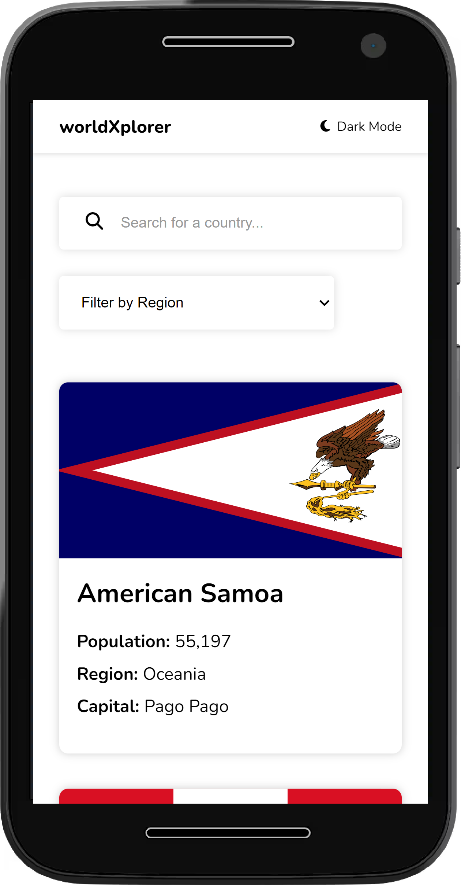
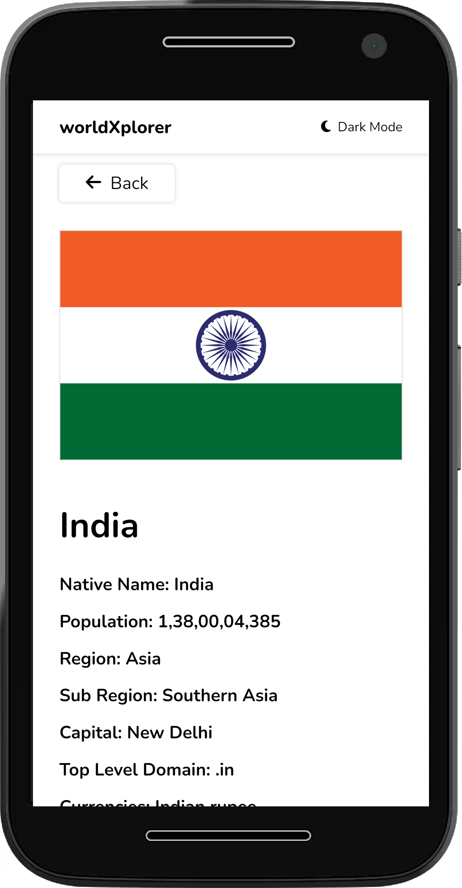

# WorldXplorer

"WorldXplorer" is an interactive and educational React web application that utilizes the power of RESTful APIs to provide comprehensive information about different countries around the globe.
This engaging web app offers users an opportunity to learn about various countries key data, including geographical location, population, capital city, currency, language and more.

## Features

- Display information of all countries.
- Show detailed information when clicking on a particular country.
- Light/dark mode toggle for better user experience in different environments.
- Live previews of country information without refreshing the page.
- Cross-platform support, making it accessible from various devices and operating systems.
- Responsive design to ensure a seamless user experience across laptops, desktops, tablets, and mobile devices.
- Search functionality to quickly find specific countries.
- Filter countries based on regions.
- Integration with external APIs to fetch real-time data about countries.
- Smooth animations and transitions for a visually appealing experience.
- Error handling and graceful fallbacks for cases of API failures or unavailable data.
- A user-friendly interface with intuitive navigation and clear layout.

## Tech Stack

- React.js
- React Router DOM
- HTML
- CSS
- JavaScript

## Run Locally

Clone the project

```bash
  git clone https://github.com/dev-akhilesh/World-App-React.git
```

Install dependencies

```bash
  npm install
```

Start the server

```bash
  npm run dev
```

## Screenshots

### Desktop View

#### Homepage(Lightmode)


#### Homepage(Darkmode)


#### Single Country(Lightmode)


#### Single Country(Darkmode)


#### Shimmer Effect - Homepage(Lightmode)


#### Shimmer Effect - Homepage(Darkmode)


#### Shimmer Effect - Single Country(Darkmode)


#### Search Functionality - Homepage(Lightmode)


#### Shimmer Effect - Homepage(Lightmode)


### Mobile View

#### Homepage

<p align="center">
  
</p>

#### Single Country page

<p align="center">
  
</p>
